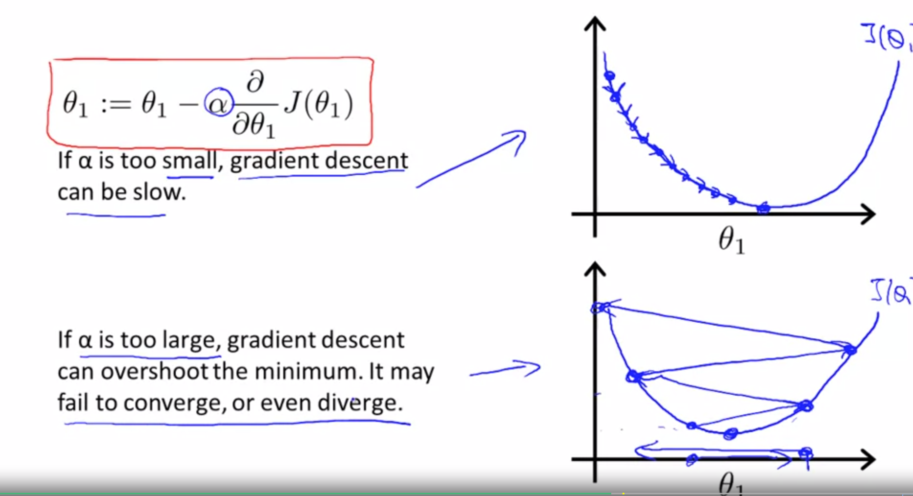

# Machine Learning
* Arthur Samuel (1959) Machine learning is the Field of study that gives computers the ability to learn without being explicitly programed
* Tom Mitchell (1998) Well-posed learning problem: A computer program is said to learn from experience E with respect to some task T and some performance measure P, if its performance on T, as measured by P, improves with experience E

## Main types of Machine Learning algorythms
- Supervised learning
- Unsupervised learning

Others:
- Reinforcement Learning 
- recommender systems

## Supervised Learning
- we gave the dataset the 'right answers'
- Regression problems / continues valued output
- Classification problems deal with discrete valued outputs ie 0 or 1 (could be 0 1 2 3)

Supervised Learning
In supervised learning, we are given a data set and already know what our correct output should look like, having the idea that there is a relationship between the input and the output.

Supervised learning problems are categorized into "regression" and "classification" problems. In a regression problem, we are trying to predict results within a continuous output, meaning that we are trying to map input variables to some continuous function. In a classification problem, we are instead trying to predict results in a discrete output. In other words, we are trying to map input variables into discrete categories. 

## Unsupervised Learning
Computer / Algorythm is given data with no real identifiers. It attempts to sort out a structure for the data on its own
For example it might notice that there are two clusters of data points on each side of the data set ie some towered x01 and y01 and some other clustered towered xN and yN
with little or none in between. It would then split these 2 'clusters'

### The cocktail party problem
Input = Audio of two people or entities (or more) talking
output = two (or more) seperate audio clips for each entity

- Cocktail party problem algorythm
    * [W, s, v] = svd((repmat(sum(x. *x, 1), size(x,1), 1).*x)*x'); 

### Model Representation
Supervised Learning
- Given the 'right answer' for each example in the data

Regression Problem
- Predict real-valued output

datasets are known as Training sets in ML

### Notation
- m = Number of Training examples
- x = "input" variable features
- y = "output" variable/ "target" variable
- (x,y) = a single training example also a row
- (x^i, y^i) = the ith training example whatever row i may be (x^2, y^2) = second row in data)

if there are 47 rows in the data then m = 47

Training set --> learning algorithm --> h (hypothesis)

def h(x): return y ---> h is a function that maps from x's to y's

in this course we will represent h as: 
hø(x) = ø0 ---> this is a univariate linear regression (one variable)

### The cost function
the ø symbol will represent the paramaters of out function

our cost function will be a linear function
         ø      ø
hø(x) =      +     x       
          0      1

### linear regression

minimize
ø0 ø1

### Cost Function

### Gradient Descent
- Algorithm used everywhere to minimize the cost function J
- Not just used with the cost function but in many places for machine learning

### Gradient Descent Algorithm

- repeatedly update parameter theta j until convergence
- := operator is equal to an assignment operator ie a:= b assigns the value of a to b. Where a = b is making an assertion that they are equal. 
- a:= a +1 --> yes! 
- a = a +1 --> no
- α sign is equal to the learning rate. if Alpha is very small then the steps we take to optimize will be small steps. If alpha is large then we are taking large steps to optimize.
- This whole algorithm is used to update theta zero and theta 1
- gradient descent must always be a simultaneous update 

### Linear Regression with one variable
Examples of incorrect usage of alpha

the steps of gradient decsent will automatically decrease the steps as it moves naturally due to the nature of the algorithm

because linear regression will always be a convex function it will have a bow shape. and because of this gradient decent will only have one `global minimum' / `global optimim` (pitfall)

`batch gradient descent`:
- each step of gradient descent uses all the training examples

